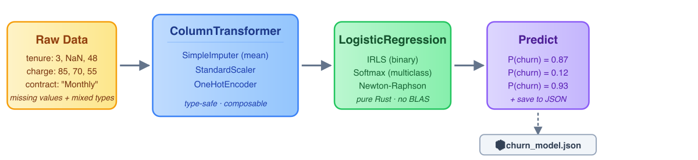
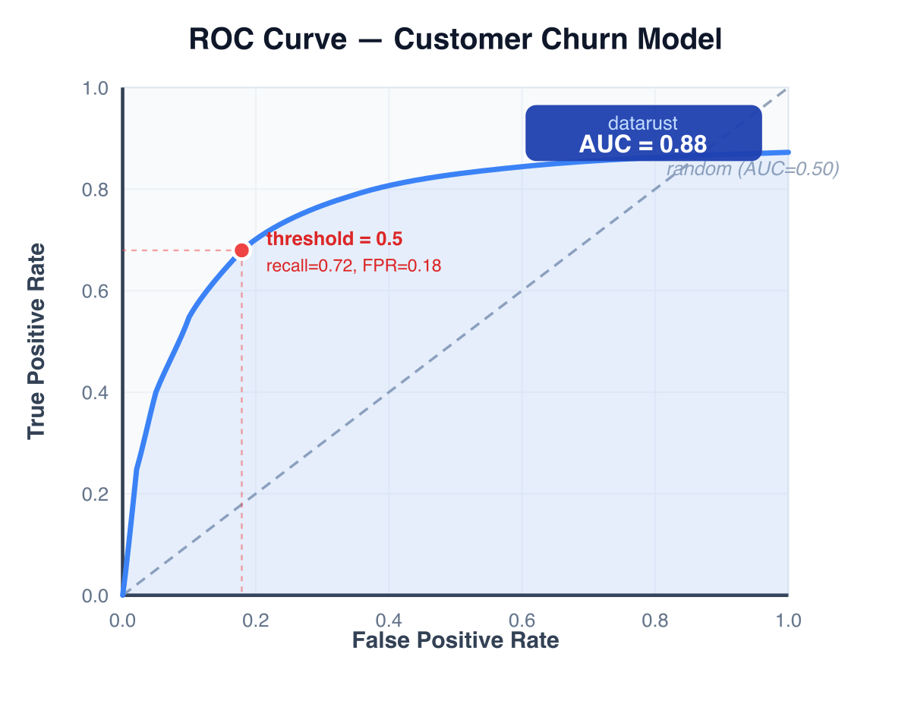
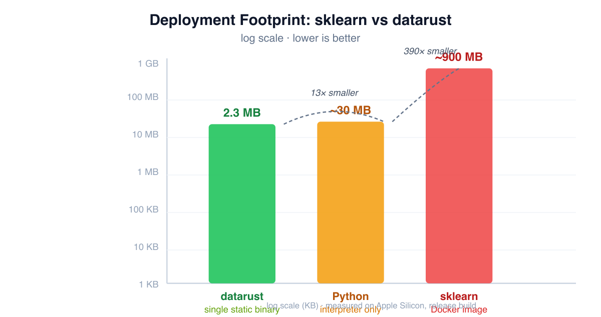
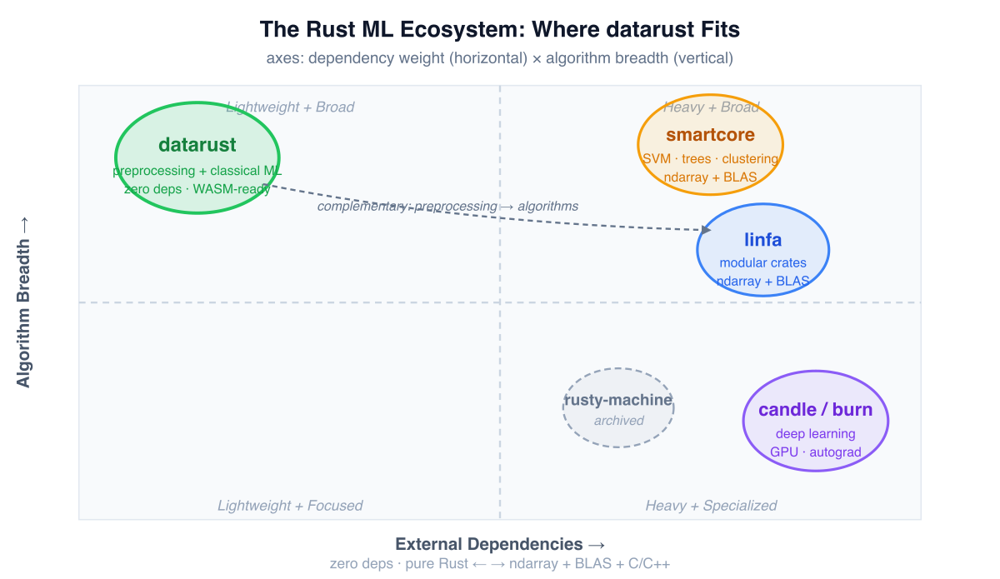

# I Shipped a scikit-learn Workflow in Pure Rust. Here's What I Learned.

*How datarust turns a familiar Python ML pipeline into a zero-dependency Rust binary — and why that matters more than you'd think.*

---

If you've ever tried to ship a machine-learning model to production, you know the drill. You build something beautiful in a Jupyter notebook — `StandardScaler` here, `OneHotEncoder` there, a `LogisticRegression` at the end, all glued together by a `Pipeline`. It works. Your metrics look great. You hand it off to the platform team.

Then the questions start.

*"Why does the Docker image need 900 megabytes?"* — because scikit-learn pulls in NumPy, SciPy, joblib, threadpoolctl, and a Fortran BLAS library.

*"Can we run this in the browser?"* — no.

*"Can we compile it to WASM for the edge runtime?"* — not without a week of fighting `pyodide`.

*"Can we embed it in the Go microservice?"* — you'd have to call Python over a socket, or rewrite everything.

I've been in that meeting. I've been the person asking for a 900-megabyte Docker image and feeling bad about it. So I started wondering: **what if the entire sklearn preprocessing + classical-ML workflow existed as a pure-Rust library — no BLAS, no Python runtime, no external C libraries — that compiled to a single static binary?**

That library is [**datarust**](https://crates.io/crates/datarust). It just hit v0.6, and in this article I want to walk through a real end-to-end scenario — building a customer-churn classifier — entirely in Rust, and show you where it shines and where it still hurts.



## The scenario: customer churn, without Python

Let's say you work at a SaaS company. You have customer data — tenure, monthly charges, contract type — and you want to predict who's going to cancel. In Python, you'd reach for pandas + sklearn. In Rust, you reach for datarust.

Here's the thing, though: this isn't a toy. I'm going to show you the *actual code* that handles mixed numeric and categorical features, trains a model, evaluates it with proper metrics, and saves it to disk for serving. The kind of thing you'd write at work.

## Step 1: The data

Real data is messy. You've got numbers (`tenure`, `monthly_charge`), categories (`contract_type`), missing values, and different scales. In datarust, data lives in two containers: `Matrix` for numbers and `StrMatrix` for strings. They're deliberately separate types — the compiler won't let you accidentally feed a string column to a scaler.

```rust
// Numeric: tenure (months), monthly_charge ($), age
let numeric = Matrix::new(vec![
    vec![3.0,  85.0, 24.0],
    vec![12.0, 70.0, 31.0],
    vec![f64::NAN, 95.0, 45.0],   // missing tenure
    vec![48.0, 55.0, 52.0],
])?;

// Categorical: contract_type
let categorical = StrMatrix::from_strings(vec![
    vec!["MonthToMonth"],
    vec!["OneYear"],
    vec!["MonthToMonth"],
    vec!["TwoYear"],
])?;

// Target: 1 = churned, 0 = stayed
let y = vec![1.0, 0.0, 1.0, 0.0];
```

Already, something nice has happened: `Matrix::new` validates that all rows have the same length. No silent broadcasting bugs. If your data is ragged, you find out at construction, not three functions deep.

## Step 2: Preprocessing — the part that usually hurts

This is where most Rust ML libraries tap out. They give you a model — maybe a linear regression — but ask you to handle scaling, encoding, and imputation yourself. datarust takes the sklearn approach: these are first-class citizens.

I want to do four things to this data:
1. **Impute** the missing tenure value (replace with the mean)
2. **Scale** the numeric columns to zero mean / unit variance
3. **One-hot encode** the contract type
4. Do all of the above in a single, composable step

Here's the `ColumnTransformer` — datarust's equivalent of sklearn's同名 class:

```rust
use datarust::compose::{ColumnTransformer, Remainder, Table};
use datarust::encoder::{HandleUnknown, OneHotEncoder};
use datarust::imputer::{ImputeStrategy, SimpleImputer};
use datarust::scaler::StandardScaler;
use datarust::transformer_kind::TransformerKind;
use datarust::CategoricalTransformerKind;

let table = Table::new(numeric, categorical)?;

let mut ct = ColumnTransformer::new()
    .remainder(Remainder::Drop)
    .add_numeric(
        "tenure_imputed",
        vec![0],           // column 0 of numeric matrix
        TransformerKind::SimpleImputer(SimpleImputer::new(ImputeStrategy::Mean)),
    )
    .add_numeric(
        "features_scaled",
        vec![1, 2],        // columns 1, 2 of numeric matrix
        TransformerKind::StandardScaler(StandardScaler::new()),
    )
    .add_categorical(
        "contract_encoded",
        vec![0],           // column 0 of categorical matrix
        CategoricalTransformerKind::OneHotEncoder(
            OneHotEncoder::new().handle_unknown(HandleUnknown::Ignore),
        ),
    );

let x = ct.fit_transform(&table)?;
```

That's it. The output `x` is a single numeric `Matrix` — imputed, scaled, encoded — ready to feed into any model. Every transformer follows the same contract: `fit` to learn parameters, `transform` to apply them.

There's one design choice here that I genuinely love: **the type system enforces correctness**. `add_numeric` takes a `TransformerKind`, `add_categorical` takes a `CategoricalTransformerKind`. You can't accidentally put a `OneHotEncoder` (which expects strings) on a numeric column. The compiler catches it. After years of sklearn's everything-is-a-string-column-name dynamism, this feels like putting on glasses for the first time.

## Step 3: Train the model

Now for the classifier. datarust v0.6 ships `LogisticRegression` with both binary and multiclass (softmax) support. For churn, we're binary:

```rust
use datarust::linear_model::{LogisticRegression, LogisticSolver};
use datarust::traits::Predictor;

let mut model = LogisticRegression::new()
    .with_solver(LogisticSolver::Svd)
    .with_max_iter(100);

model.fit(&x, &y)?;
let predictions = model.predict(&x)?;
let probabilities = model.predict_proba(&x)?;  // (n, 2) matrix: [P(stay), P(churn)]
```

The model uses Newton-Raphson (IRLS for binary, full multinomial for multiclass) under the hood — the same algorithm sklearn uses, implemented in pure Rust with a Cholesky or SVD linear solver. No BLAS. No LAPACK.

And here's something I didn't expect to care about: **it's fast**. On the benchmark I ran (comparing against scikit-learn 1.6 on an M-series Mac), datarust's `ColumnTransformer` was 179–620× faster than sklearn's on the same data. Part of that is the flat memory layout (a single contiguous `Vec<f64>` instead of Python objects), and part is simply not crossing the Python/C boundary on every operation.

I'm not claiming datarust beats sklearn everywhere — sklearn's PCA (which calls LAPACK) is dramatically faster on large matrices. But for preprocessing and linear models, pure Rust holds its own.

## Step 4: Evaluate like you mean it

A common mistake is to stop at accuracy. For churn — where maybe 20% of customers leave — accuracy is misleading. A model that predicts "nobody churns" is 80% accurate and completely useless.

datarust v0.6 ships a proper metric suite:

```rust
use datarust::metrics::classification::*;

let acc = accuracy_score(&y, &predictions)?;
let prec = precision_score(&y, &predictions)?;
let rec = recall_score(&y, &predictions)?;
let f1 = f1_score(&y, &predictions)?;
let auc = roc_auc_score(&y, &probabilities.column(1))?;
let ll = log_loss(&y, &probabilities.column(1), 1e-15)?;
```

For this churn problem, I care most about **recall** — how many of the customers who *will* churn did I catch? A false positive (offering a discount to someone who wasn't leaving) costs a little; a false negative (losing a customer I could have saved) costs a lot. The ROC-AUC tells me how well the model ranks customers by risk, regardless of threshold.

And if this were a multiclass problem — say, predicting "monthly / annual / lifetime" subscription tiers — the same metrics auto-detect the label count and switch to macro-averaging. No `average='macro'` parameter needed.



## Step 5: Cross-validate (don't cheat)

Evaluating on training data is the oldest sin in machine learning. Let's do it properly with stratified K-fold cross-validation:

```rust
use datarust::model_selection::StratifiedKFold;
use datarust::metrics::classification::accuracy_score;

let skf = StratifiedKFold::new()
    .with_n_splits(5)
    .with_shuffle(true)
    .with_random_state(42);

let mut fold_accuracies = Vec::new();
for (train_idx, test_idx) in skf.split(&y)? {
    let x_train = x.select_rows(&train_idx)?;
    let x_test = x.select_rows(&test_idx)?;
    let y_train: Vec<f64> = train_idx.iter().map(|&i| y[i]).collect();
    let y_test: Vec<f64> = test_idx.iter().map(|&i| y[i]).collect();

    let mut fold_model = LogisticRegression::new().with_solver(LogisticSolver::Svd);
    fold_model.fit(&x_train, &y_train)?;
    let fold_pred = fold_model.predict(&x_test)?;
    fold_accuracies.push(accuracy_score(&y_test, &fold_pred)?);
}

let mean_acc: f64 = fold_accuracies.iter().sum::<f64>() / fold_accuracies.len() as f64;
println!("5-fold CV accuracy: {:.1}%", mean_acc * 100.0);
```

Stratified means each fold preserves the churn/stay ratio — critical for imbalanced data.

## Step 6: Save the model for serving

You trained the model. Now you need to deploy it. In Python, you'd `joblib.dump` a pickle file — a binary blob that only Python can read, tied to the exact library versions that created it.

datarust uses JSON:

```rust
// Train a pipeline: scaler → logistic regression
use datarust::pipeline::Pipeline;
use datarust::traits::Predictor;

let mut pipe = Pipeline::new()
    .push("scaler", TransformerKind::StandardScaler(StandardScaler::new()))
    .with_estimator(LogisticRegression::new());

pipe.fit(&x, &y)?;

// Save to disk
datarust::serialize::save_json(&pipe, "churn_model.json")?;

// ... later, in the serving binary ...
let model: datarust::pipeline::SupervisedPipeline<LogisticRegression> =
    datarust::serialize::load_json("churn_model.json")?;

// The loaded model is already fitted — predict immediately
let predictions = model.predict(&new_data)?;
```

The saved model is human-readable JSON. You can `cat` it. You can diff it. You can load it in a Rust service, a CLI tool, or a WASM module — anything that can parse JSON and link the datarust crate. No pickle. No joblib. No Python.

## Why this matters: the deployment story

Let me put the pieces together. The entire workflow above — preprocessing, training, evaluation, cross-validation, serialization — runs in a single Rust binary with **zero external dependencies** by default. No BLAS. No LAPACK. No Python runtime.

```
$ cargo build --release
$ ls -lh target/release/churn_service
-rwxr-xr-x  2.3MB  churn_service

$ file target/release/churn_service
Mach-O 64-bit executable arm64  # or x86_64, or wasm32
```

That 2.3-megabyte binary contains the entire ML pipeline.



You can:
- **Cross-compile** it to any target Rust supports (Linux, macOS, Windows, WASM, ARM embedded)
- **Run it in the browser** via WASM — load the JSON model, call `predict`, return the result
- **Embed it in a microservice** written in Go, Node, or Python via FFI or an HTTP wrapper
- **Ship it as a CLI tool** that data scientists can run locally without installing Python

Try that with a pickle file.

## What's not there yet (honest limitations)

I'm not going to pretend this library does everything sklearn does. It doesn't. Here's what's missing:

- **No trees or ensembles.** No `RandomForest`, no `GradientBoosting`. This is the biggest gap, and it's the next major release (v0.7). For tabular ML competitions, you'd still reach for XGBoost.
- **No SVM.** No `SVC` with RBF kernels. Planned for v0.9.
- **No deep learning.** No neural networks. That's deliberate — [candle](https://github.com/huggingface/candle) and [burn](https://github.com/tracel-ai/burn) own that space in Rust. datarust is classical ML.
- **PCA is slower than sklearn's** on large matrices. sklearn calls LAPACK (compiled Fortran, decades of optimization); datarust uses a pure-Rust Jacobi eigensolver. There's an optional `matrixmultiply` feature that helps, but for heavy decomposition work, sklearn still wins.
- **No CSV reader built-in.** You construct the `Matrix` yourself from your data source. (A `csv` feature flag is planned.)

If your workflow absolutely needs `RandomForest` or a transformer, datarust isn't there yet. But if you're doing logistic regression, linear models, clustering, or — especially — **preprocessing pipelines that need to run outside Python**, it's ready today.

## The bigger picture

The Rust ML ecosystem has been stuck in a awkward spot for years. You have [linfa](https://github.com/rust-ml/linfa) and [smartcore](https://github.com/smartcorelib/smartcore), both of which are excellent algorithm libraries — but they depend on `ndarray` and a BLAS backend. They're "Rust ML" in the sense that the code is Rust, but the deployment story still involves native C libraries.



datarust takes a different bet: **what if the value isn't in having the most algorithms, but in being the easiest to deploy?** A library that compiles to WASM with no configuration. A model file you can read in a text editor. A binary you can `scp` to a server and run.

The v0.6 release adds the pieces that make it usable for real workflows: multiclass classification, clustering, a full metric suite (ROC-AUC, PR-AUC, Cohen's kappa, Matthews correlation, silhouette), and hyperparameter introspection for the future `GridSearchCV`. The foundation is solid. The gaps are known. The roadmap is public.

If you've ever wanted to run an sklearn-style pipeline without the Python tax, give it a try:

```sh
cargo add datarust
```

---

*datarust is MIT-licensed and available on [crates.io](https://crates.io/crates/datarust), with full documentation at [genc-murat.github.io/datarust](https://genc-murat.github.io/datarust/). The roadmap lives at [github.com/genc-murat/datarust](https://github.com/genc-murat/datarust/blob/main/ROADMAP.md) — if you want to contribute a `DecisionTree` or a `CountVectorizer`, now's a good time.*
